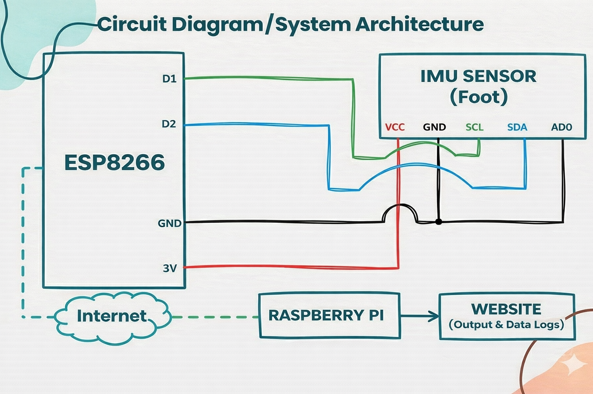
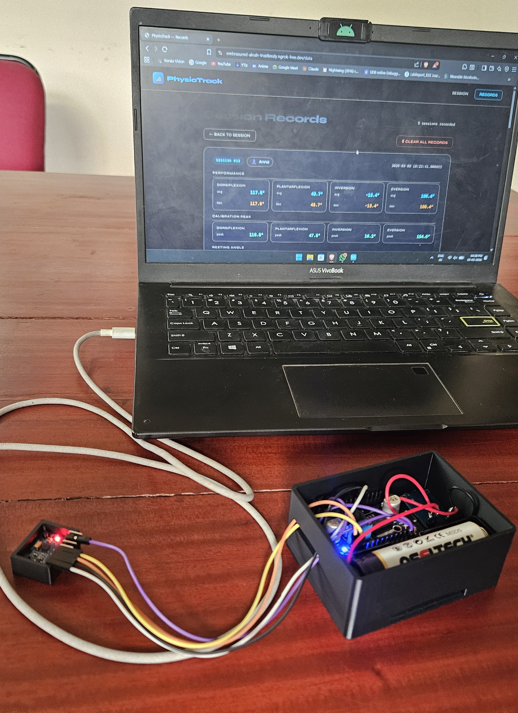
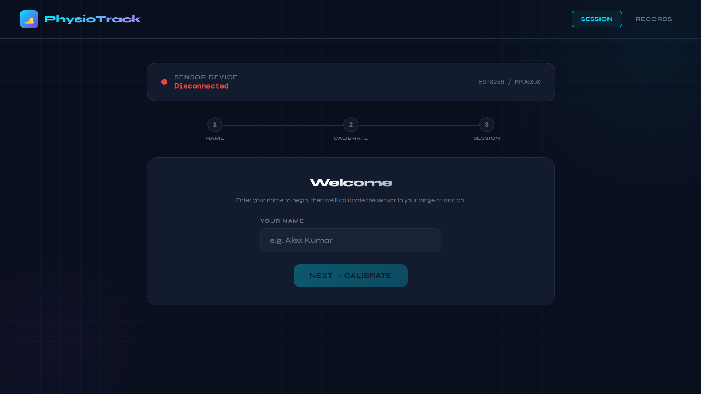
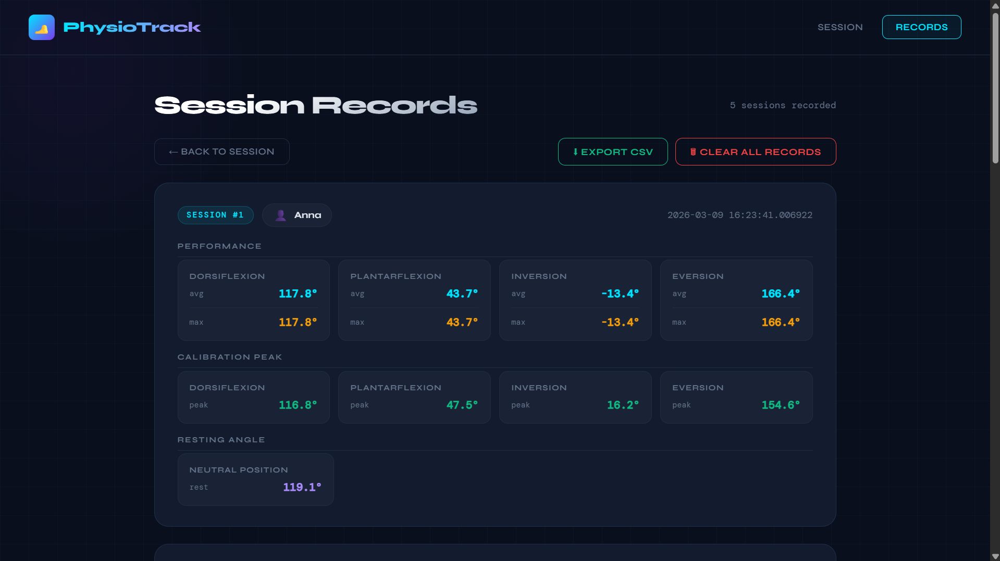

# PhysioTrack – Smart Ankle Rehabilitation Monitoring System

PhysioTrack is an IoT-based ankle rehabilitation monitoring system designed to assist physiotherapy patients in performing ankle exercises correctly. The system measures ankle joint movements in real time using an MPU6050 IMU sensor connected to an ESP8266 microcontroller and provides guided feedback through a web interface.

The project tracks four major ankle rehabilitation movements:

- Dorsiflexion
- Plantarflexion
- Inversion
- Eversion

Sensor data is transmitted wirelessly to a Raspberry Pi server where a Flask-based web application processes the movement and provides feedback to the user.

---

# System Architecture

---

# Hardware Components

- ESP8266 (NodeMCU)
- MPU6050 IMU Sensor
- Raspberry Pi
- Li-ion Battery
- TP4056 Charging Module
- LM2596 Buck Converter
- Connecting Wires / Prototype Board

---

# Product Prototype

---

# Software Stack

- **Python (Flask)** – Backend server
- **HTML / CSS / JavaScript** – Web interface
- **SQLite** – Database for session data
- **Arduino Framework** – ESP8266 firmware

---

# Website Interface

---

# Features

- Real-time ankle movement monitoring
- Guided physiotherapy exercises
- Threshold-based movement validation
- Session-based rehabilitation tracking
- Automatic logging of average and maximum angles
- Web-based interface for user interaction

---

# How It Works

- The MPU6050 sensor on the ankle continuously reads raw accelerometer data across 3 axes.
- The ESP8266 averages multiple samples and computes two angles — Dorsiflexion/Plantarflexion and Inversion/Eversion — using atan2.
- Computed angles are sent to the Raspberry Pi server via WiFi every 100ms as JSON over HTTP.
- Before each session, a calibration step captures the patient's resting position and peak range of motion for all four movements.
- The Flask server compares live angles against the calibrated peak thresholds and streams real-time feedback to the browser via WebSocket.
- The web interface shows the current angle, target, and movement status — guiding the physiotherapist through each movement.
- On session end, summary statistics (average, max, calibration peaks, resting angle) are saved to a SQLite database and can be exported as CSV.

---

# Future Improvements

- Integration into a wearable rehabilitation sock
- Addition of EMG sensors to monitor muscle activation
- Machine learning models to analyze rehabilitation performance
- Improved UI/UX for the web interface
- Mobile application integration

