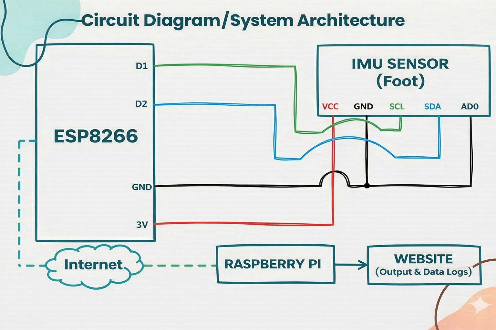
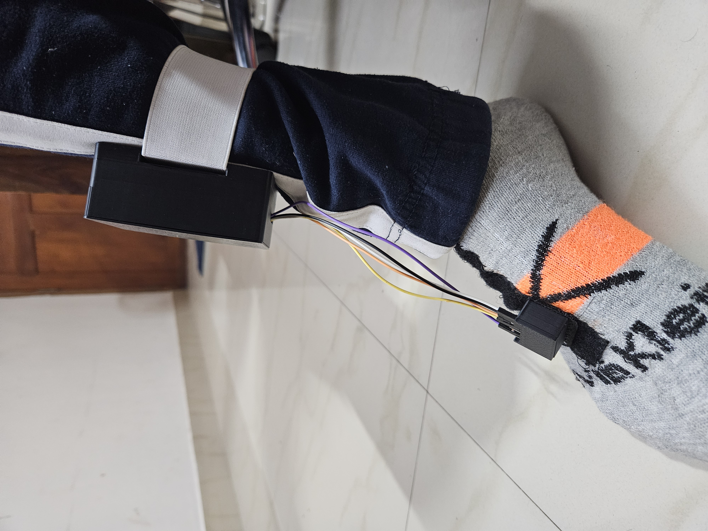
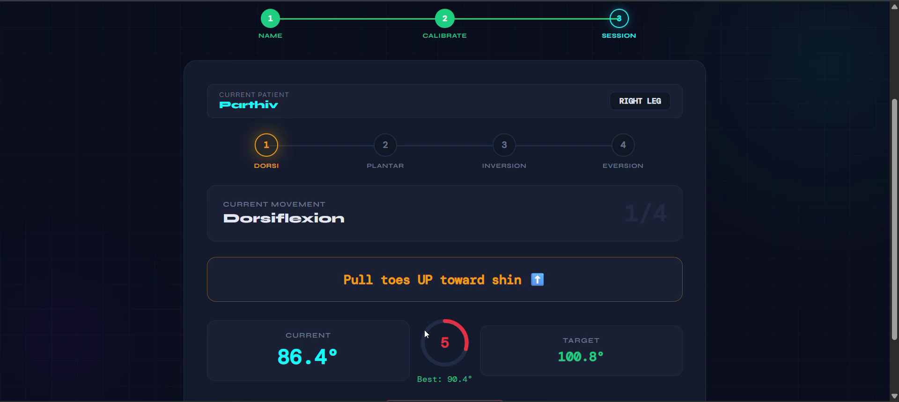
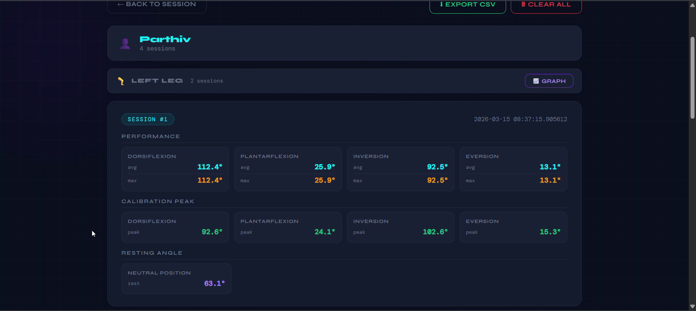
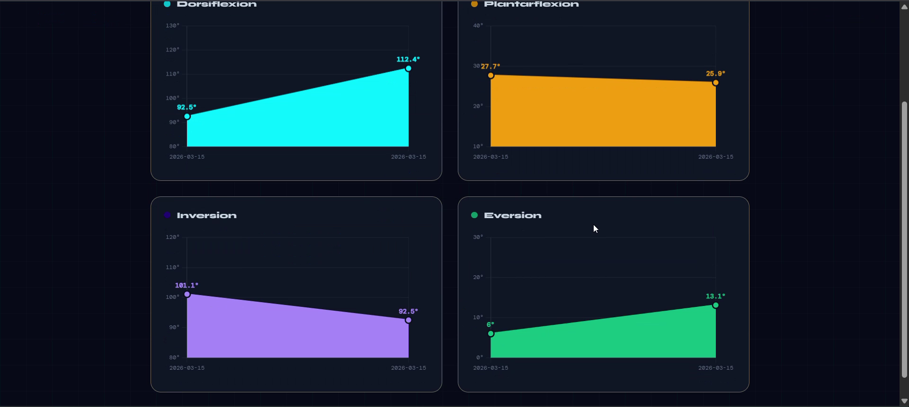

# PhysioTrack – Smart Ankle Rehabilitation Monitoring System

PhysioTrack is a low-cost IoT-based ankle rehabilitation monitoring system designed to assist physiotherapy patients in performing rehabilitation exercises accurately while enabling physiotherapists to monitor progress in real time. The system combines wearable inertial sensing, wireless communication, embedded processing, and a responsive web dashboard to provide quantitative ankle joint movement analysis during rehabilitation sessions.

The project was developed as part of a Bachelor of Technology final-year project in Electronics and Instrumentation Engineering at FISAT.

---

# Overview

PhysioTrack continuously monitors ankle joint orientation using an MPU6050 six-axis IMU sensor mounted on the patient’s ankle. An ESP8266 NodeMCU processes sensor data and wirelessly transmits computed joint angles to a Raspberry Pi server every 100 ms.

The Raspberry Pi hosts a Flask-SocketIO-based web application that provides:

- Real-time rehabilitation feedback
- Patient-specific calibration
- Session tracking
- Progress visualization
- CSV export functionality
- Longitudinal rehabilitation monitoring

The system tracks four clinically significant ankle rehabilitation movements:

- Dorsiflexion
- Plantarflexion
- Inversion
- Eversion

---

# Key Features

- Real-time ankle movement monitoring
- Patient-specific calibration system
- Wireless IoT-based architecture
- Real-time WebSocket feedback
- Live angle visualization dashboard
- Automatic session recording
- Progress tracking graphs
- CSV export support
- Left/right leg laterality correction
- Mobile-responsive web interface
- Low-cost hardware implementation (~INR 1,260)

---

# System Architecture



### Data Flow

1. MPU6050 reads ankle orientation data
2. ESP8266 averages sensor samples and computes angles
3. Computed angles are transmitted via HTTP POST every 100 ms
4. Raspberry Pi Flask server processes incoming data
5. Flask-SocketIO pushes live updates to the web dashboard
6. Session statistics are stored in SQLite database

---

# Hardware Components

| Component | Description |
|---|---|
| ESP8266 NodeMCU | WiFi-enabled microcontroller |
| MPU6050 IMU | 6-axis inertial measurement unit |
| Raspberry Pi | Flask-SocketIO server |
| 18650 Li-ion Battery | Portable power source |
| TP4056 Module | Battery charging module |
| LM2596 Buck Converter | Voltage regulation |
| MCP1700 LDO | 3.3V regulation |
| Velcro Strap | Ankle mounting mechanism |

---

# Product Prototype



---

# Power Supply Architecture


The portable hardware system is powered using:

- 18650 Li-ion battery
- TP4056 charging module
- LM2596 buck converter
- 3.3V regulated supply for ESP8266 and MPU6050

Estimated operating current:

- MPU6050: ~3.9 mA
- ESP8266 during WiFi transmission: ~80 mA

---

# Software Stack

| Technology | Purpose |
|---|---|
| Python Flask | Backend server |
| Flask-SocketIO | Real-time communication |
| SQLite | Session database |
| HTML/CSS/JavaScript | Web dashboard |
| Chart.js | Progress graphs |
| Arduino Framework | ESP8266 firmware |
| Socket.IO | Browser communication |

---

# Angle Computation and Signal Processing

The system computes ankle joint orientation using normalized accelerometer values from the MPU6050 sensor.

## Sample Averaging

Five accelerometer samples are averaged every cycle to reduce sensor noise:

```math
A_x = \frac{\sum_{i=1}^{5} ax_i}{5 \times 16384.0}
```

The ESP8266 collects five samples with a 5 ms delay between readings, creating a 25 ms averaging window.

---

## Dorsiflexion / Plantarflexion Angle

```math
\theta_{DP}=atan2(A_x,A_z)\times\frac{180}{\pi}+90
```

---

## Inversion / Eversion Angle

```math
\theta_{IE}=atan2(A_y,A_z)\times\frac{180}{\pi}+90
```

The +90° shift aligns the ankle resting position near 90°.

---

# Calibration System

Before each rehabilitation session, the physiotherapist performs a patient-specific calibration process.

The calibration captures:

- Resting neutral ankle position
- Maximum dorsiflexion angle
- Maximum plantarflexion angle
- Maximum inversion angle
- Maximum eversion angle

The calibrated values become personalized rehabilitation targets for that patient.

Returning patients can automatically reuse previously saved calibration values.

---

# Real-Time Feedback System

The Flask-SocketIO server streams live updates to the browser using WebSockets.

The dashboard displays:

- Current angle
- Best angle achieved
- Target calibrated angle
- Movement instructions
- Countdown timer
- Session progress

Observed latency between movement and dashboard update is below 150 ms on local WiFi networks.

---

# Website Interface

## Live Rehabilitation Session Dashboard



Features:

- Live angle monitoring
- Real-time feedback
- Countdown timer
- Calibration workflow
- Movement guidance

---

## Patient Records Dashboard



Features:

- Patient-wise session storage
- Left/right leg organization
- Calibration threshold records
- Average and maximum angle logs

---

## Progress Graph Dashboard



Features:

- Longitudinal rehabilitation tracking
- Per-movement progress graphs
- Session comparison
- Recovery trend visualization

---

# Database Features

The SQLite database stores:

- Patient name
- Selected leg
- Resting angle
- Calibrated thresholds
- Maximum angles
- Average angles
- Session timestamp

The system supports:

- Automatic schema migration
- Per-patient rehabilitation history
- CSV export functionality

---

# Results

- Stable real-time angle monitoring achieved
- Reliable WiFi communication at 100 ms intervals
- Successful left/right leg laterality correction
- Real-time latency below 150 ms
- Effective progress tracking across sessions
- Mobile-responsive dashboard implementation

---

# Future Improvements

- Dual MPU6050 configuration for relative joint angle tracking
- EMG sensor integration for muscle activation analysis
- Machine learning-based movement classification
- ESP32 migration with BLE support
- Progressive Web App (PWA) implementation
- Multi-joint rehabilitation support
- Wearable rehabilitation sock integration


---

# Conclusion

PhysioTrack demonstrates that a low-cost embedded IoT system can provide accurate, real-time ankle rehabilitation monitoring with personalized feedback and long-term progress tracking. The project integrates embedded firmware, wireless communication, server-side processing, and responsive web technologies into a scalable rehabilitation platform suitable for both clinical and home-based physiotherapy applications.
